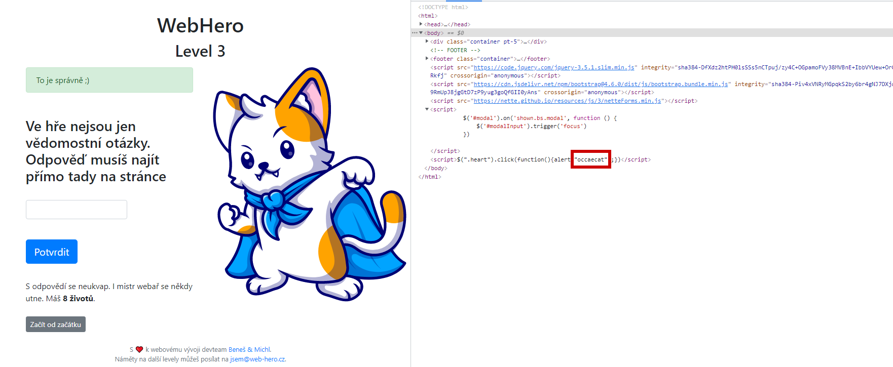
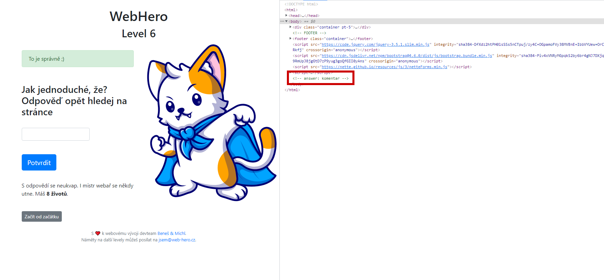
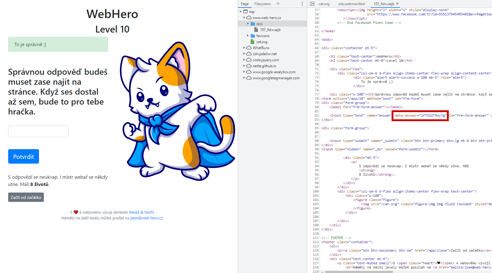
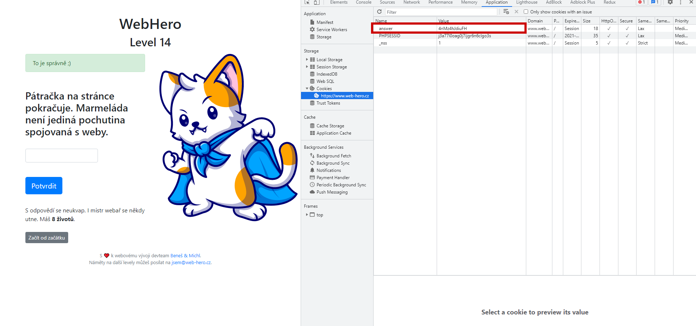
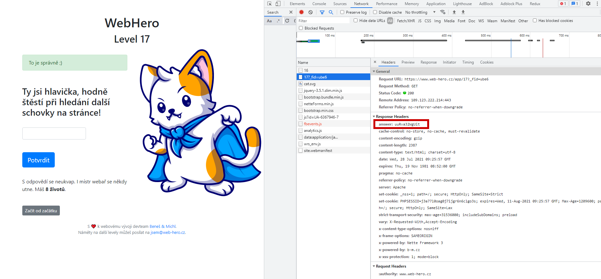
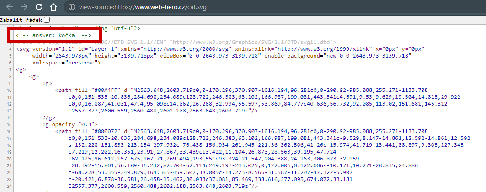

# Solutions for [WebHero](https://www.web-hero.cz/ "Hra pro webové nadšence") game

Solutions for WebHero "search in the page" questions.

## Level 3

The answer is shown by clicking on the heart in the footer, or can be seen in the source.

## Level 6

The answer is located in the comment at the bottom of the HTML source.

## Level 10

The answer is hidden in an input tag as the value of atribute `data-answer`.

## Level 14

The answer in located in cookies.

## Level 17

The answer is in the response header.

## Level 19

The answer is hidden in the `cat.svg` picture as a comment.

*Note: The SVG file is the same throughout the game, do not get confused.*

